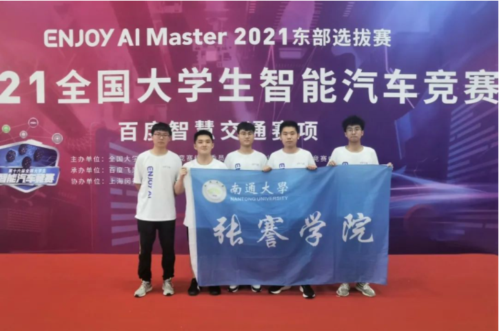
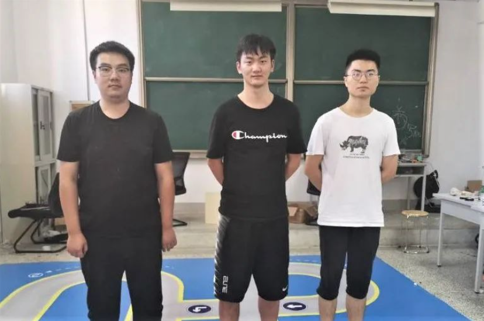
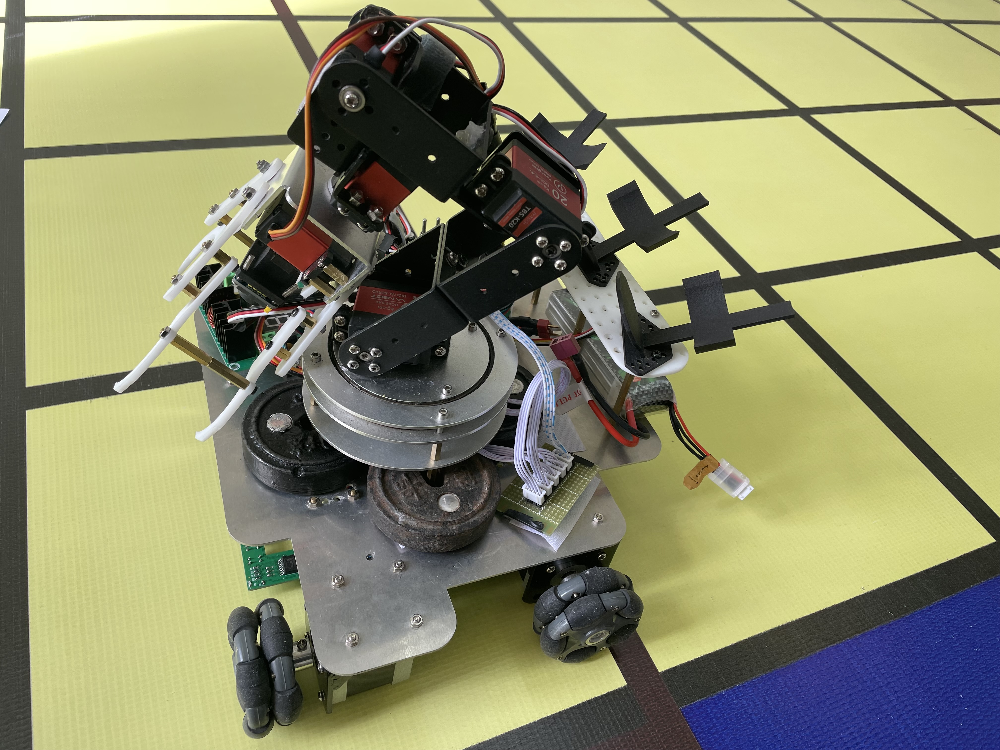
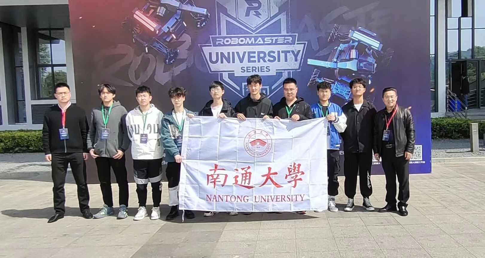

<strong>第十六届全国大学生智能汽车竞赛百度组国家级一等奖(南通大学首次)</a></strong> 完成者: 杨启硕、泮佳俊、祁瀚文、孙楚迪、付晨。
比赛简介: 该比赛基于深度学习的智能车在实际领域中的应用，将深度学习技术赋予机器智能行为。团队在原有硬件的基础上通过PaddlePaddle框架以及AI studio在线开发平台，利用计算机视觉技术、车道线定位和识别技术、交通标志与指示牌的检测和识别技术、目标物检测与识别技术等多种人工智能技术配合传感器以及机械结构使用，实现小车的自主巡航、模型推理、侧方停车、抓取物块、倾倒小球、击中靶心等任务。

 

<strong>第十六届全国大学生智能汽车竞赛电磁越野组国家级二等奖</a></strong> 完成者: 赵恒、张帆。
比赛简介: 该比赛基于深度学习的智能车在实际领域中的应用，将深度学习技术赋予机器智能行为。团队在原有硬件的基础上通过PaddlePaddle框架以及AI studio在线开发平台，利用计算机视觉技术、车道线定位和识别技术、交通标志与指示牌的检测和识别技术、目标物检测与识别技术等多种人工智能技术配合传感器以及机械结构使用，实现小车的自主巡航、模型推理、侧方停车、抓取物块、倾倒小球、击中靶心等任务。

 

<strong>第十五届全国大学生智能汽车竞赛百度组国家级二等奖</a></strong> 完成者: 周昆阳、殷佳炜、冯文宇。
比赛简介: 团队通过运用深度学习的方法进行标志物检测并完成各项任务，前期在服务器上训练模型，并将模型部署到官方提供的小车上，利用控制算法完成各项任务。

 

<strong>全国大学生工程能力竞赛物流赛项国家级铜奖</a></strong> 完成者: 李昀迪、刘鑫慧、张宸萌、周昆阳。
比赛简介: 该比赛侧重对学生动手能力、编程能力考察，学生前期需要自己制作电路板，并对其性能进行测试，同时物流小车的结构也需要自行进行设计，根据比赛方提供的要求。完成对车整体结构设计后，需要学生利用C语言编写小车任务程序，并对其中的参数进行调优，使其能够准确、迅速地完成指定的任务。

 

<strong>Robomaster全国大学生机器人大赛国家级二等奖(南通大学首次)</a></strong> 完成者: 李昀迪、周昆阳。
比赛简介: 作为国内首个激战类机器人竞技比赛，RoboMaster大赛在其诞生伊始就凭借其颠覆传统的比赛方式、震撼人心的视听冲击力、激烈硬朗的竞技风格，吸引到全国数百所高等院校、近千家高新科技企业以及数以万计的科技爱好者的深度关注。参赛队员将通过比赛获得宝贵的实践技能和战略思维，将理论与实践相结合，在激烈的竞争中打造先进的智能机器人。

 
